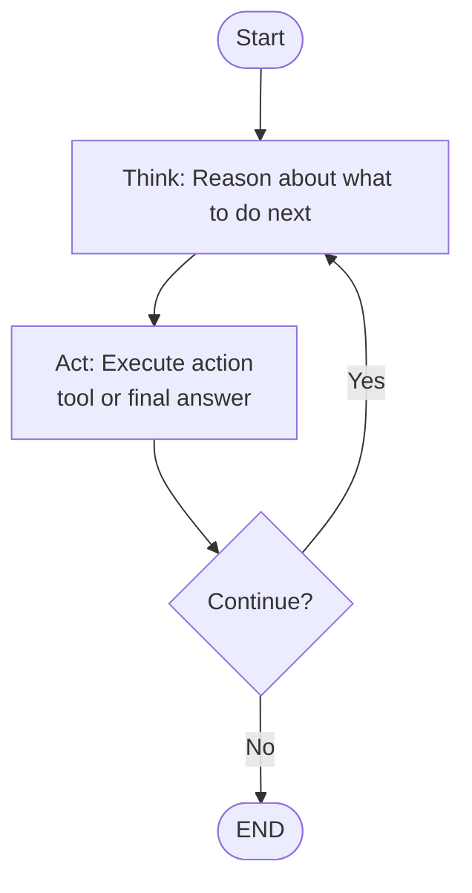

# ReAct Agent with LangGraph

A simple implementation of a ReAct (Reasoning + Acting) agent using LangGraph for learning purposes. This agent interleaves thinking (reasoning) and acting in a loop until it reaches a final answer.

## Features

- **ReAct Pattern**: Agent alternates between thinking and acting in a loop
- **Multiple Tools**: Web search (Tavily API) and calculator for mathematical expressions
- **Chat History**: Stores conversation history in Pinecone for context-aware responses
- **LangGraph Workflow**: Simple two-node workflow (Think → Act) with iteration loop
- **Detailed Logging**: See the agent's reasoning process step-by-step

## Architecture



**ReAct Loop:**
1. **Think**: Agent reasons about what to do next
2. **Act**: Execute the chosen action (web search, calculator, or provide answer)
3. **Observe**: Process the result
4. **Repeat**: Continue until final answer is reached

## Setup

### 1. Install uv (if not already installed)

```bash
curl -LsSf https://astral.sh/uv/install.sh | sh
```

### 2. Clone and setup environment

```bash
cd variant1
cp .env.example .env
# Edit .env with your API keys
```

### 3. Configure API Keys

Edit `.env` file:

```env
ANTHROPIC_API_KEY=your_anthropic_api_key_here
OPENAI_API_KEY=your_openai_api_key_here  # Optional - improves chat history quality
PINECONE_API_KEY=your_pinecone_api_key_here
PINECONE_INDEX_NAME=chat-history
TAVILY_API_KEY=your_tavily_api_key_here
```

**Note on API Keys:**
- `ANTHROPIC_API_KEY` - **Required** for the agent
- `OPENAI_API_KEY` - **Optional** - If provided, uses OpenAI embeddings for better chat history similarity matching. Falls back to simple embeddings if not set.
- `PINECONE_API_KEY` - Optional - If not set, uses in-memory mock mode
- `TAVILY_API_KEY` - Optional - Required only for web search functionality

### 4. Install dependencies

```bash
uv pip install -e .
```

Or install packages directly:

```bash
uv pip install langgraph langchain langchain-anthropic pinecone-client python-dotenv requests
```

### 5. Run the agent

```bash
uv run python agent.py
```

## Usage

### Interactive Mode

Run the agent interactively in a terminal:

```bash
uv run python agent.py
```

### Testing with Detailed Logging

Run the test script to see detailed agent reasoning:

```bash
uv run python test_agent.py
```

This will show:
- **Think Node**: Agent's reasoning about what to do next
- **Act Node**: Tool execution or final answer
- **Iteration Loop**: The ReAct cycle in action
- **Memory Operations**: Chat history storage/retrieval from Pinecone

### Programmatic Usage

```python
from agent import ReActAgent

agent = ReActAgent(max_iterations=5)
response = agent.run("What is 15 + 27?")
print(response)
```

### Logging Output Example

```
============================================================
THINK NODE (Iteration 1)
============================================================
Retrieving relevant chat history...
No relevant history found
Generating thought and action...
Thought: This is a simple arithmetic problem that I can solve directly
Action: final_answer
Action Input: 15 + 27 = 42

------------------------------------------------------------
ACT NODE
------------------------------------------------------------
Providing final answer
Final answer provided - ending
```

## Sample Prompts

### Testing Web Search Tool

```
What are the latest developments in AI this week?
```
**Expected behavior**:
1. **Think**: Agent realizes it needs current information
2. **Act**: Uses web_search to find recent AI news
3. **Think**: Reviews search results
4. **Act**: Provides final answer with recent developments

```
Who won the latest Formula 1 race?
```
**Expected behavior**: Agent searches for current F1 race results and provides the winner.

### Testing Chat History

First, have a conversation:
```
My favorite programming language is Python.
```

Then reference it later:
```
What are some good libraries for my favorite language?
```
**Expected behavior**: Agent retrieves context from Pinecone, remembers Python is your favorite, and suggests Python libraries.

### Testing ReAct Loop

```
Compare the populations of Tokyo, London, and New York City, then tell me which is largest.
```
**Expected behavior**:
1. **Think**: Agent decides to search for Tokyo population
2. **Act**: web_search for Tokyo
3. **Think**: Agent decides to search for London population
4. **Act**: web_search for London
5. **Think**: Agent decides to search for NYC population
6. **Act**: web_search for NYC
7. **Think**: Agent compares results
8. **Act**: final_answer with comparison

### Testing Simple Reasoning

```
What is 15 times 8?
```
**Expected behavior**: Agent uses the calculator tool to evaluate the expression and provides the result.

### Testing History Context

Conversation 1:
```
I'm learning about machine learning.
```

Conversation 2:
```
What topics should I focus on next?
```
**Expected behavior**: Retrieves previous conversation about ML from Pinecone and provides contextual recommendations.

## Testing

### Test Chat History (Memory)

Run comprehensive memory tests:

```bash
uv run python test_memory.py
```

This tests:
- **Storage**: Storing conversations in Pinecone (or mock mode)
- **Retrieval**: Finding relevant history based on queries
- **Context awareness**: Retrieving contextual information
- **Clear history**: Deleting stored conversations

**Mock Mode**: If PINECONE_API_KEY is not set, tests run in mock mode using in-memory storage. This is perfect for testing the logic without requiring API credentials.

## Project Structure

```
variant1/
├── agent.py           # ReAct agent implementation
├── memory.py          # Pinecone chat history manager (with mock mode)
├── tools/             # Tools directory
│   ├── __init__.py    # Tools package initialization
│   └── tools.py       # Tools: web search (Tavily) and calculator
├── test_agent.py      # Agent tests with detailed logging
├── test_memory.py     # Memory/chat history tests
├── pyproject.toml     # Project dependencies (uv)
├── .env.example       # Environment variables template
├── .env               # Your API keys (gitignored)
└── README.md          # This file
```

## How It Works: The ReAct Loop

The ReAct agent operates in a simple but powerful loop:

### 1. Think (Reasoning)
- Retrieves relevant chat history from Pinecone (first iteration)
- Analyzes the current situation
- Reasons about what action to take next
- Decides between:
  - **web_search**: Get current information from the internet
  - **calculator**: Evaluate mathematical expressions
  - **final_answer**: Provide the answer

### 2. Act (Acting)
- Executes the chosen action
- If web_search: Calls Tavily API and stores observation
- If calculator: Evaluates mathematical expression and stores result
- If final_answer: Provides response and ends loop

### 3. Observe
- Processes the result of the action
- Stores observation in state for next iteration

### 4. Repeat
- Loop continues until final_answer is provided
- Maximum 5 iterations (configurable)

**Key Advantages:**
- Simpler than Plan-Execute (only 2 nodes vs 3)
- More flexible (can adapt based on observations)
- Easier to understand and debug
- Natural reasoning flow

## Chat History Quality

The agent supports two modes for chat history embeddings:

**With OpenAI API Key** (Recommended):
- Uses `text-embedding-3-small` model
- Excellent semantic similarity matching
- Retrieves contextually relevant conversations

**Without OpenAI API Key** (Fallback):
- Uses simple word-based embeddings
- Basic similarity matching
- May retrieve less relevant context

To enable high-quality embeddings, just add `OPENAI_API_KEY` to your `.env` file.

## Limitations (Educational Implementation)

- **MCP Integration**: Direct Tavily API calls rather than full MCP server setup
- **Error Handling**: Basic error handling for learning purposes
- **Scaling**: Not optimized for production use
- **Max Iterations**: Hard limit of 5 iterations to prevent infinite loops

## Extending the Agent

### Add More Tools

The agent uses LangChain's tool system. Add new tools using the `@tool` decorator in the `tools/` directory:

```python
from langchain_core.tools import tool

@tool
def calculator(expression: str) -> str:
    """Evaluate mathematical expressions."""
    # Implementation
    return str(eval(expression))
```

Then add it to `get_tools()` in `tools/tools.py`:

```python
def get_tools():
    return [web_search, calculator]
```

The agent will automatically discover and use new tools via Claude's tool calling API.

### Improve Memory

Replace hash-based embeddings with proper embedding models:

```python
from langchain_openai import OpenAIEmbeddings

embeddings = OpenAIEmbeddings()
```

### Add More Nodes

Extend the LangGraph workflow with additional nodes like a reflection node or validation node.

## Troubleshooting

**Issue**: Pinecone connection errors
- Verify your API key and environment in `.env`
- Check that index is created in the correct region

**Issue**: Tavily search not working
- Ensure `TAVILY_API_KEY` is set correctly
- Install `requests` package: `uv pip install requests`

**Issue**: Agent not remembering context
- Check Pinecone index has data: view in Pinecone console
- Verify similarity threshold (0.5) isn't too high

## Resources

- [LangGraph Documentation](https://langchain-ai.github.io/langgraph/)
- [Anthropic Claude API](https://docs.anthropic.com/)
- [Pinecone Documentation](https://docs.pinecone.io/)
- [Tavily Search API](https://tavily.com/)

## License

MIT - Educational purposes
